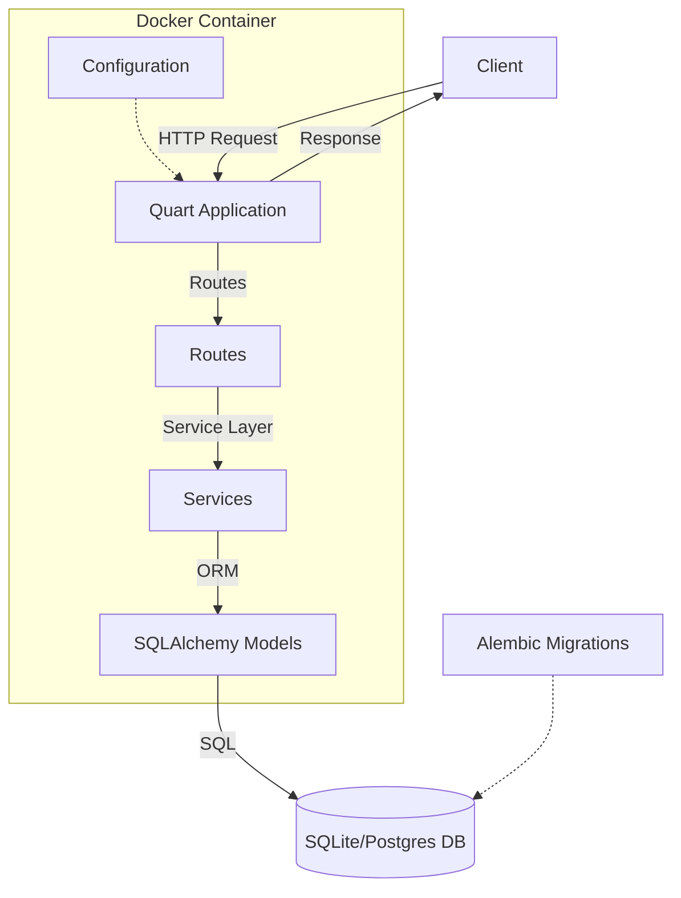
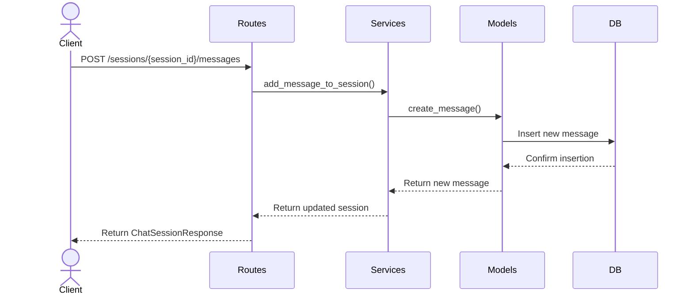
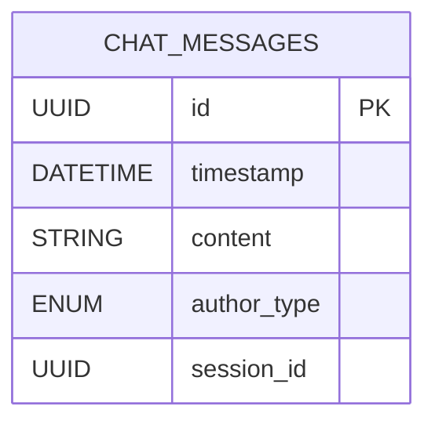

# chat-service

Chat service is a simple micro service that offers an API for a customer support chat to

- start chat sessions
- send messages to chat sessions
- retrieve chat sessions

## Overview

### Main Dependencies

The main dependencies of the project are:

- [Poetry](https://python-poetry.org/docs/) for dependency management.
- [Quart](https://quart.palletsprojects.com/en/latest/), an async web micro framework whose API is mostly consistent
  with flask.
- [Pydantic](https://docs.pydantic.dev/latest/) for data validation and for documenting response models.
- [SQLAlchemy](https://www.sqlalchemy.org/) with its ORM functionality.
- [Alembic](https://alembic.sqlalchemy.org/en/latest/) for database migrations
- [Typed-Settings](https://typed-settings.readthedocs.io/en/latest/getting-started.html) for structured configuration
  through TOML files.
- [Pytest](https://docs.pytest.org/en/stable/) for testing.


### Architecture




### Data Flow
This a loose sequence diagram to capture the data flow in the application.



### Data Model




## Project Structure

```
.
├── README.md                 # Project documentation and overview
├──pyproject.toml            # Project metadata and dependencies
├── poetry.lock               # Poetry dependency lock file
├── Dockerfile                # Instructions for building the Docker image
├── docker-compose.yml        # Docker Compose configuration for local deployment
├── chat_service              # Main application package
│  ├── __init__.py            
│  ├── app.py                 # Main application setup and configuration
│  ├── asgi.py                # ASGI entry point for the application
│  ├── config.py              # Configuration loading and management
│  ├── model                  # Data models subpackage
│  │   ├── __init__.py        # Model package initializer (initializing the db engine)
│  │   └── chat.py            # Chat-related data models
│  ├── routes.py              # API route definitions
│  ├── schema.py              # Shared data types
│  ├── services.py            # Business logic and service layer for interacting with the data model
│  ├── test                   # Test package
│  │   ├── __init__.py        # Test package initializer
│  │   └── test_routes.py     # Tests for API routes
│  └── transport.py           # Data transfer objects and API models
├── config                    # Configuration directory
│  └── config.toml            # TOML configuration file
├── alembic.ini               # Configuration file for Alembic (database migration tool)
├── migrations                # Database migration scripts
│  ├── env.py                 # Alembic environment configuration
│  ├── script.py.mako         # Alembic migration script template
│  └── versions               # Migration version scripts
       └── 01_9018b4fb75f3_create_messages_table.py  # Initial migration script
```

## Setup

### Installing Dependencies

This project uses poetry. You can install all dependencies by running

```bash
poetry install
```

### Running Tests

The project contains a couple of unit tests. Once all dependencies have been installed, you can run them using pytest:

```
poetry run pytest
```

### Formatting, Typing and Linting

This project is formatted using `black` and `isort`. It is linted using `flake8` and type checked using `mypy`.

## Running the service and testing the API

### Running the Service

In the project, there is a dockerfile and a docker-compose file provided. You can use it to run the service locally:

```bash
docker-compose up --build
```

This should spin up a postgres database, run the migrations and then start an instance of the service on port 8080.

You can check success by going to [localhost:8080/health](http://localhost:8080/health).

### Testing the API

Once the service is up and running, you should be able to access the Swagger docs for the API under
[localhost:8080/docs](http://localhost:8080/docs). This will also give you a UI to interact with the different endpoints:

1. You can call the `POST /sessions` endpoint to create a new chat session. The response will provide you with an `id` of the session.
2. You can use this id as a `session_id` in the `POST /sessions/{session_id}/messages` endpoint to send a message to the chat.
3. You can also use this id as a `session_id` in the `GET /sessions/{session_id}` endpoint to retrieve the whole session with all messages.

# Current Limitations and Future Enhancements

This project serves as a basic implementation of a chat service backend. While functional, it has several limitations that would need to be addressed for a production-ready system:

**Current Limitations:**
1. Lack of Authentication: The API is currently unprotected, making it unsuitable for public access.
2. Minimal User Management: The system only distinguishes between customer and service agent message authors, without proper user roles or permissions.
3. Limited Testing: The test suite consists of basic end-to-end tests and requires expansion for more comprehensive coverage.
4. Simplified Data Model: The current model uses a single `chat_messages` table, which may not suffice for complex real-world scenarios.

**Potential Enhancements:**
1. User Management and Authentication:
   - Implement a separate user management service
   - Add authentication with claims-based permissions and TTL

2. Real-time Communication:
   - Replace polling with WebSockets for instant updates
   - Implement shared models between frontend and backend

3. Architecture Improvements:
   - Refactor to a clear three-layer architecture (presentation, business logic, data access)
   - Create domain objects independent of views for flexibility

4. Enhanced Session Management:
   - Implement a dedicated session table for metadata and analytics
   - Track session outcomes, duration, and participant details
   - Support agent assignment and role-based escalation

5. AI Integration:
   - Explore LLM integration for intelligent responses
   - Design fallback mechanisms for quick human escalation

6. Advanced Features:
   - Develop a sophisticated agent assignment system
   - Implement Single Sign-On (SSO) using OIDC for service agents

These enhancements would significantly improve the system's functionality, scalability, and real-world applicability.